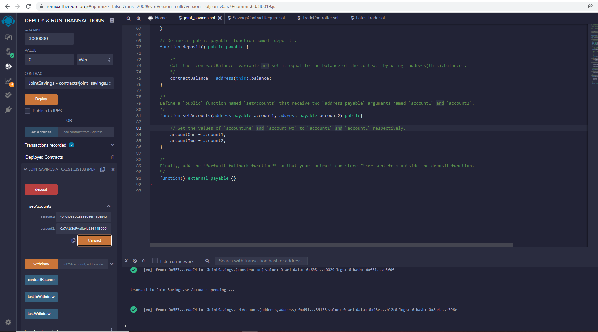
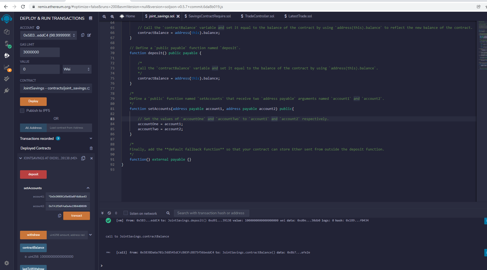
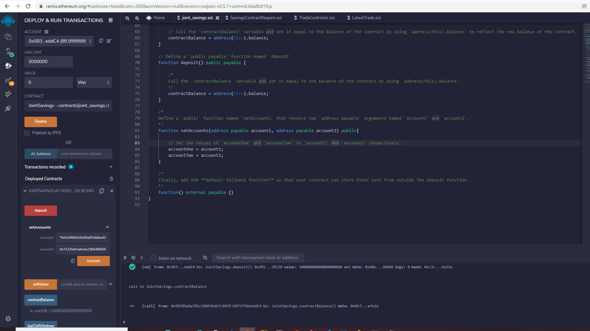
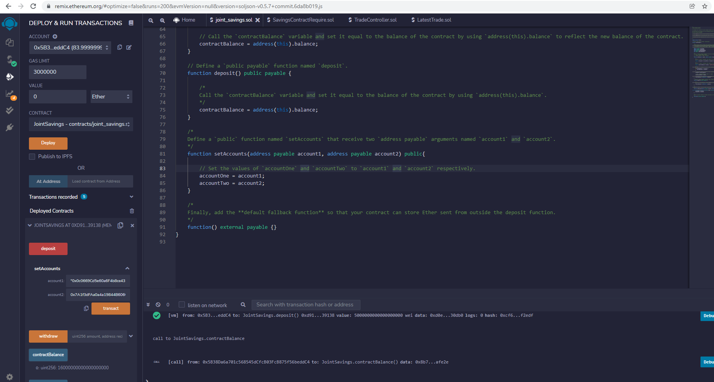
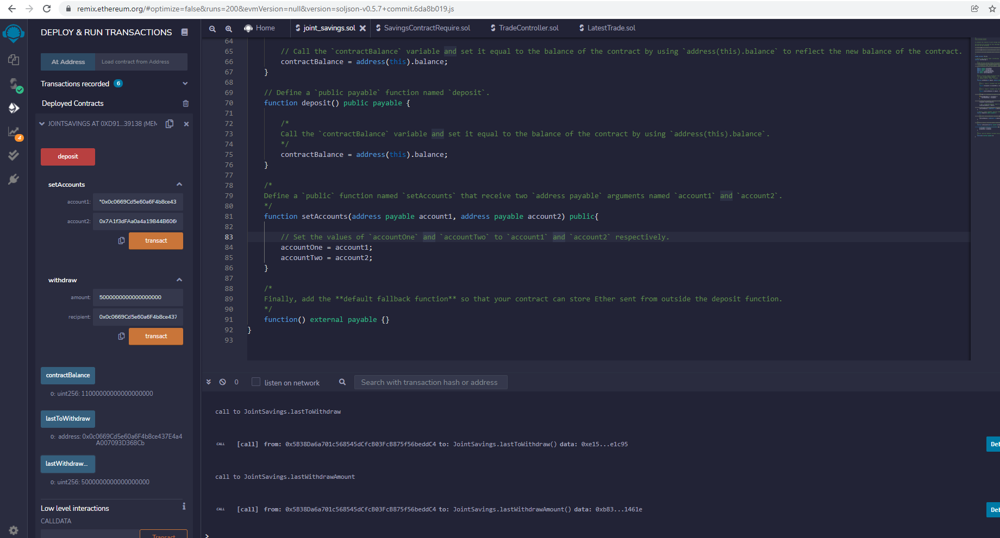
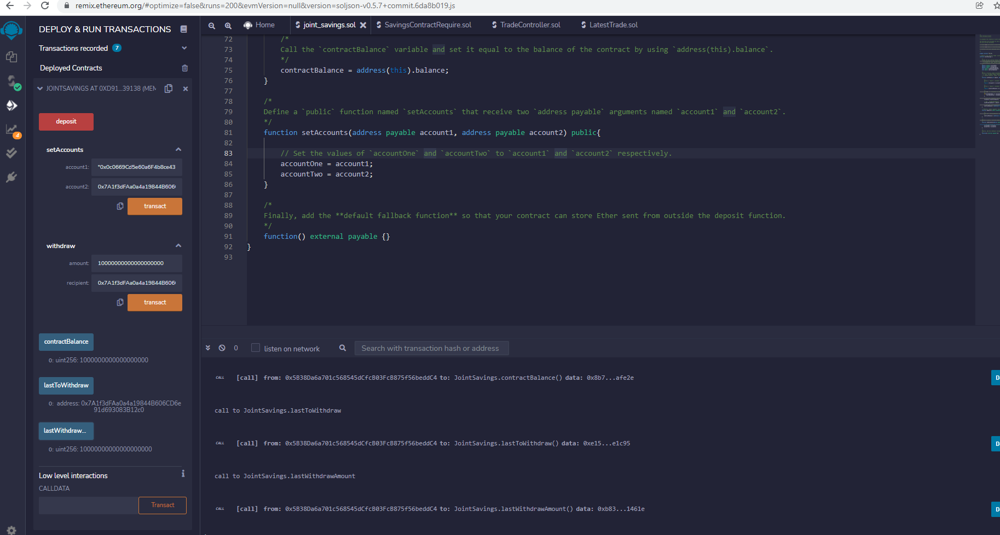

# Module 20 Challenge - Joint Savings Account using Solidity Smart Contract

## Description

Building a Solidity smart contract using ether management funtions to implement a financial institution's requirements for providing the features of the joint savings account.  This contract accepts two user addresses that will be used to control the joint savings account created with the contract. 

The sections of this project are as follows: 

* Create a Joint Savings Account Contract in Solidity 
* Compile and Deploy Your Contract in the JavaScript VM
* Interact with Your Deployed Smart Contract (This demonstration is shown in the folloing README section.)

---

## Interact with Your Deployed Smart Contract

The following screenshots demonstrates the JointSavings contract being deployed and the corresponding funtions being successfully executed.   

1. Use the `setAccounts` function to define the authorized Ethereum address that will be able to withdraw funds from your contract.    

2. Test the deposit functionality of your smart contract by sending the following amounts of ether. After each transaction, use the `contractBalance` function to verify that the funds were added to your contract:

* Transaction 1: Send 1 ether as wei:

* Transaction 2: Send 10 ether as wei:

* Transaction 3: Send 5 ether:
 

3. Once you’ve successfully deposited funds into your contract, test the contract’s withdrawal functionality by withdrawing 5 ether into `accountOne` and 10 ether into `accountTwo`. After each transaction, use the `contractBalance` function to verify that the funds were withdrawn from your contract. Also, use the `lastToWithdraw` and `lastWithdrawAmount` functions to verify that the address and amount were correct. 

* Withdrawal 1: Withdraw 5 ether into `accountOne`:

* Withdrawal 2: Withdraw 10 ether into `accountTwo`:

---

## Technologies

This project leverages Remix IDE to build and test smart contracts that are created in Solidity.  Using the web version of Remix IDE, there is no need to install any software. 

* [Remix IDE](https://remix.ethereum.org/) - Open source application for developing, deploying, and administering smart contracts that run in Ethereum-based blockchains.

---

## Contributors

Marc Leipold

Email: marcleipold@gmail.com

GitHub: https://github.com/marcleipold

LinkedIn: https://www.linkedin.com/in/marc-leipold/

---

## License

MIT
